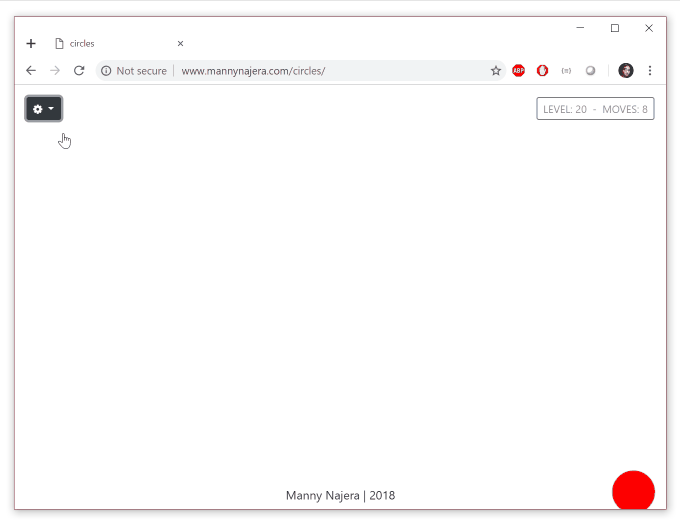

# circles
This is a simple JavaScript puzzle game, using [CreateJS](http://createjs.com) to handle 2D rending and animations.  It is currently hosted [here](http://mannynajera.com/circles).

**Example Gameplay:**

